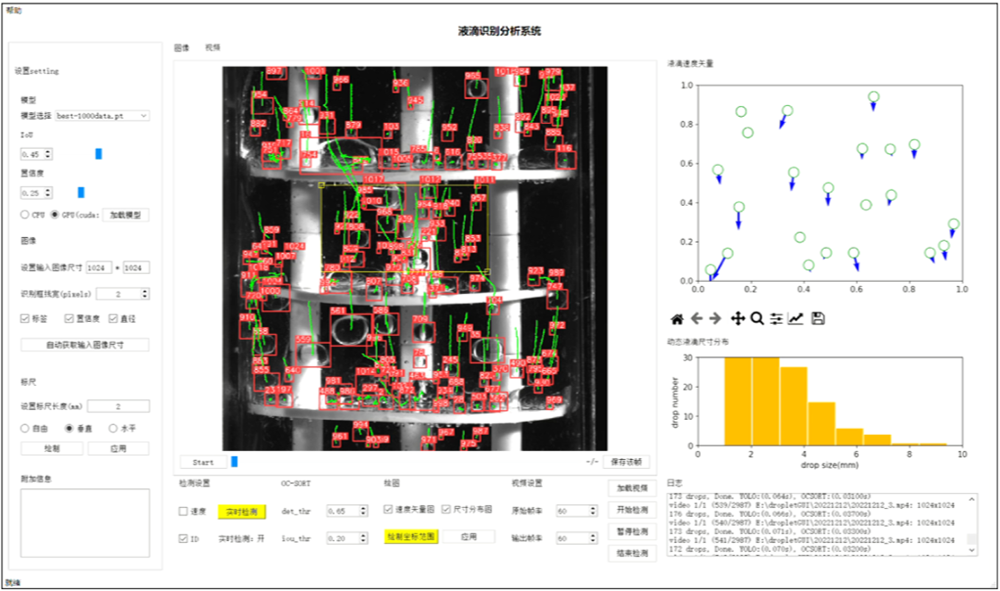

# DDTA
Droplet Detection and Tracking in Complex Motions: A Deep Learning-based Approach

## Abstract
In the realm of chemical engineering, solvent extraction is pivotal for separating valuable components from mixtures. Precise understanding of droplet dynamics is crucial for enhancing extraction column efficiency. However, analyzing dispersed-phase droplets during solvent extraction operations remains challenging due to their complex motions and interactions.This study proposes an enhanced model for droplet detection and tracking in complex motions. Building upon the YOLOv5s object detection framework, we refine the model to accurately detect droplets and recognize their size characteristics. Additionally, we integrate YOLOv5s with the OC-SORT algorithm to develop a robust droplet tracking model capable of tracing nonlinear droplet motion trajectories under both pulsed and non-pulsed conditions.   Experimental results demonstrate that our approach achieves high accuracy and faster detection speeds, with a detection accuracy of 0.977 and a 40\% increase in speed compared to the original model. This study not only validates the effectiveness of our model through manual labeling but also provides a solid foundation for further research into the complex fluid dynamics in extraction columns.

## Features

- **Image Analysis**
  - Multiple format support (JPG/PNG/TIFF)
  - Pixel-to-real-world calibration
  - Size distribution histograms
  - CSV results export

- **Video Processing**
  - Real-time detection mode
  - Object tracking with trajectory visualization
  - Velocity vector analysis
  - Frame-by-frame navigation

- **Customization**
  - Adjustable detection parameters (confidence/IOU)
  - GPU/CPU support
  - Multiple model weight support
  - Custom display ranges

## Installation

### Prerequisites
- Python 3.8+
- NVIDIA GPU (recommended) + (CUDA 11.3+)
- PyTorch 1.12.0+
- OpenCV 4.5.4+

### Setup
```bash
# Clone repository
git clone https://github.com/yourusername/droplet-analysis-system.git
cd droplet-analysis-system

# Create virtual environment (recommended)
python -m venv venv
source venv/bin/activate  # Linux/MacOS
venv\Scripts\activate  # Windows

# Install dependencies
pip install -r requirements.txt

# Download pretrained weights
mkdir weights
wget -P weights https://github.com/ultralytics/yolov5/releases/download/v6.1/yolov5m.pt
```

### Results Preview
 
